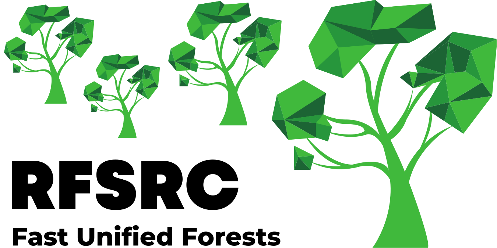

#  randomForestSRC <a href="https://luminwin.github.io/randomForestSRC/">

<!-- badges: start -->

<!-- badges: end -->

Fast OpenMP parallel computing of Breiman's random forests for univariate, multivariate, unsupervised, survival, competing risks, class imbalanced classification and quantile regression. Extreme random forests and randomized splitting. Suite of imputation methods for missing data. Fast random forests using subsampling. Confidence regions and standard errors for variable importance. New improved holdout importance. Case-specific importance.  Minimal depth variable importance. Visualize trees on your Safari or Google Chrome browser. Anonymous random forests for data privacy. 

